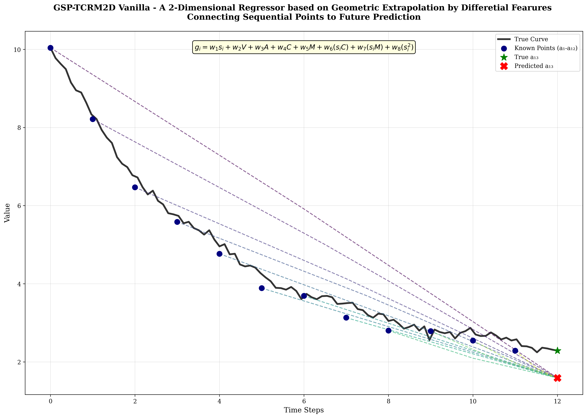
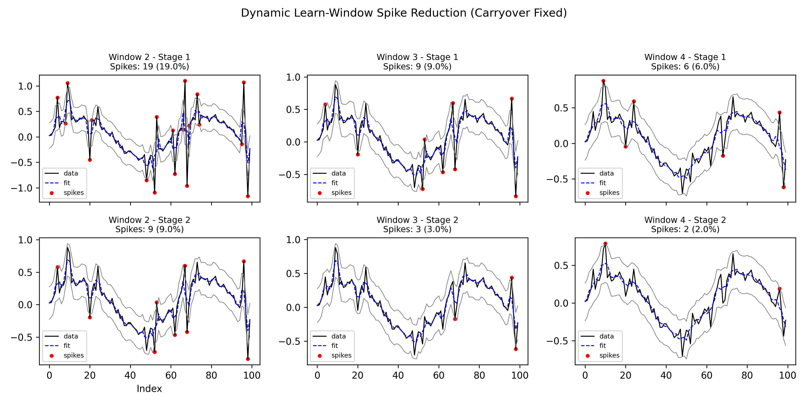

<sub>Note: Official Pre-Print of Research paper will be published soon, until then citation or use of paper is strictly prohibited by any means, this summary transcript was made public for team use only. Contact Author Shakhyar Gogoi</sub> 
\
[](wwww.linkedin.com/in/shakhyar-gogoi)


# GSP-TCRM2D Vanilla &mdash; 2Dimensional Geometric Spoke Pull & Tube Cliping Regressor Machine




## Overview

We have developed a new Edge AI Regressor Architecture that runs even on small compute devices. Here in this Github Repo, we will use the model to solve a very interesting problem, *calculating soil moisture decay*, with our **spoke-based regression method**, which is a feature to an SIH-2025 problem statemt(SIH25062), which will be presented by the team EternalzTech.
Team Members:
- Ankur Kaman
- Arkajeet Bhattacharjee
- Nitish Kumar Das
- Devahuti Phukan
- Shrutidhara Tasa
- Shakhyar Gogoi (repo admin/owner)

*In this example, we will use this method to predict and construct a moisture decay graph, using soil moisture values of the past 12 minutes and their slopes rather than traditional regression, and predicting when the moisture will cross our critical thresold of dryness, and back tracing to predict how long we should water instead of just outputing binary signals : water or not water*

**Key goals:**  
- Lightweight computation suitable for on-field irrigation sensors
- Raise alerts beforhand so that measures could be taken by the farmers, instead of waiting for moisture to fall down critical points to trigger alert. 
- Even during irrigation, backtrace a relationship between decay and growth graph so that we dont overwater the plant.
- Understand how "Thirsty" the plant is and dont supply unnecessary water even when the plant doesnt needs it.

### **Motivation? Why this example?**

Soil drying and Plant absorption are non-proportional/non-linear. Just having If else statement is too dangerous, why? Here are the reasons:
- In **hilly/dry areas**, if we have already irrigated the plant, it might've absorbed adequate amount of water; But just because the weather was dry-> moisture from soil dropped, and we irrigated again!!
- This is a **very dangerous** event as water is scarce in such areas, we just can not afford to lose more water from our precious limited reservoirs.
- This may also result in overwatering and harming the plant.

#### Factors leading to this uncertainity:
- Ambient Temperature: More heat =  more evaporation
- Ambient Humidity: Less humid = More evaporation
- Plant absorption rate: We dont know at what rate plant absorbs water; Depends upon the following:

    1. Surface area of Roots: More extensive spread  = More absorption
    2. Last osmosis rate
    3. How much water is lost by transpiration
    4. Number of stomata per leaf area
    5. Number of leaves

 
### ***SOLUTION:***

Soil moisture decays in a non linear way, there are no fixed proportions that helps us know when will the soil completely dry up after its been irrigated. 


**We cannot predict soil moisture decay with so many features on edge devices**. Either: 
1. We need a lot of data **OR**
2. We need an AI to learn these factors, small enough to run on small compute devices, but without compromising efficiency.
\
\
Both of these methods seem impossible, only Neural Nets can fit to such volatile changes, but thats not possible to run RNN, LSTM, CRNN, etc on Arduino sized MCUs. Arduino Nano, has only 2KB SRAM, thats not possible to fit/make any model in just 2KB for such a complex task.

For that we had to develop a completely new Architecture that:
- Has Smart cold loading from persistent storage instead of keeping entire models as hot cache
- Learns all the features and predict on the go on even smallest computers.
- Has very small inference cost(load pretrained weights and just multilply them with realtime differential input features)

**We will use this Architecture in generating the moisture decay graph on an Arduino nano.**


More low level technical description will be given below.
# Methodology

### 1. Spoke-Based Prediction
- **Input:** 12 consecutive soil moisture readings (`a₁` to `a₁₂`) and their slopes (`s₁` to `s₁₁`)  
- **Spokes:** Each point generates a “spoke” to predict the next point (`a₁₃`).  
- **Prediction formula:**

**Key Innovation**: First geometric tubing approach for spoke systems that transfers geometric intelligence to neural weights during training, enabling fast inference without geometric computations.

##  Core Architecture

### Spoke-Based Prediction System
- **Input**: 12 sequential points (a₁ to a₁₂) and their slopes (s₁ to s₁₁)
- **Spoke Creation**: From each point aᵢ, create a "spoke" (line) to predicted point a₁₃
- **Weighted Spoke Slopes**: Sophisticated 8-weight formula:

```math
g_i = w₁s_i + w₂V + w₃A + w₄C + w₅M + w₆(s_iC) + w₇(s_iM) + w₈(s_i²)
```
Where:

V = Decay Velocity

A = Acceleration

C = Curvature

M = Momentum

# [WARNING] General Prohibition &mdash;  For team use only: 
**This Github Pre-Print Transcript is pending and under version beta-vanilla, do not follow or copy any graphs, differential tweaks still left and are based on synthetic generated test data.**




